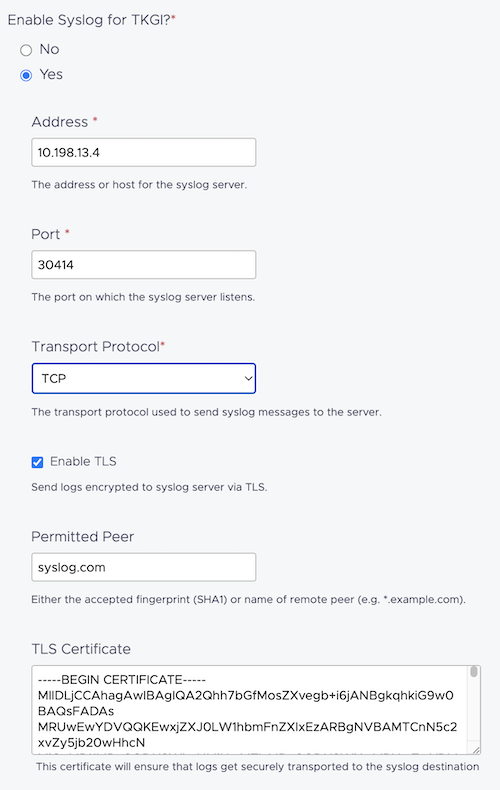

# Tanzu Kubernetes Grid Integrated Edition to OpenTelemetry

## External Components
- cert-manager
- opentelemtry-operator
- opensearch-operator

### Install Cert Manager

Cert Manager is needed by opentelemetry Operator and to create a TLS Cert for Syslog Receiver (NB: TKGi LogSink needs secure transport)

```shell
kubectl apply -f https://github.com/cert-manager/cert-manager/releases/download/v1.12.8/cert-manager.yaml
kubectl wait pods -l app=webhook -n cert-manager --for=condition=Ready
```

### Install opentelemetry-operator 
```shell
kubectl apply -f https://github.com/open-telemetry/opentelemetry-operator/releases/latest/download/opentelemetry-operator.yaml
kubectl wait pods -l control-plane=controller-manager -n opentelemetry-operator-system  --for=condition=Ready
```

### Install opensearch (log backend)

```shell
helm repo add opensearch-operator https://opensearch-project.github.io/opensearch-k8s-operator/
helm install opensearch-operator opensearch-operator/opensearch-operator
```

```shell
kubectl apply -f os-minimal.yaml
# credentials: admin/admin
```

## Collect Logs

### Create TLS cert+key for syslog receiver endpoint

Create a self-signed CA + a cert request via cert-manager. Cert and Key are stored in a secret for Otel-collector pod

```shell
kubectl apply -f cert-request.yaml
```

### Create a OpenTelemetryCollector for logs pipeline

This OpenTelemetryCollector receive logs via syslog protocol (TLS) and export them to OpenSearch.

TLS is a requirement for LogSink (fluentBit)

This manifest also create a NodePort service to access the syslog endpoint from outsite the Kube cluster.

```shell
kubectl apply -f otel-col-syslog.yaml
```

### Create a ClusterLogSink (incluster)

ClusterLogSink is a CRD to configure embedded fluentbit. This config push log to our newly created syslog receiver.

```shell
kubectl apply -f ClusterLogSink.yaml
```

### Configure TKGI Monitoring Features on Host

Address and Port from the Node Port
```shell
kubectl get svc otelcol-syslog-hosts-svc
```

Permited Peer == CN
```shell
kubectl get certificate syslog-otel | grep commonName
```

TLS Certificate
```shell
kubectl get secret syslog-otel-tls -o json -o=jsonpath="{.data.tls\.crt}" | base64 -d
```




## Collect Metrics

FIXME


# useful Links

https://github.com/open-telemetry/opentelemetry-collector-contrib/tree/main/receiver/syslogreceiver

https://docs.vmware.com/en/VMware-Tanzu-Kubernetes-Grid-Integrated-Edition/1.20/tkgi/GUID-installing-vsphere.html#optional-host-monitoring-10

https://docs.vmware.com/en/VMware-Tanzu-Kubernetes-Grid-Integrated-Edition/1.20/tkgi/GUID-installing-vsphere.html#optional-incluster-monitoring-11

https://github.com/bdereims/pks-prep/blob/master/cluster-log-sink.yaml
https://knowledge.broadcom.com/external/article/298605/logsinks-troubleshooting-for-tkgi.html

https://github.com/influxdata/telegraf/commits/master/plugins/outputs/opentelemetry/README.md